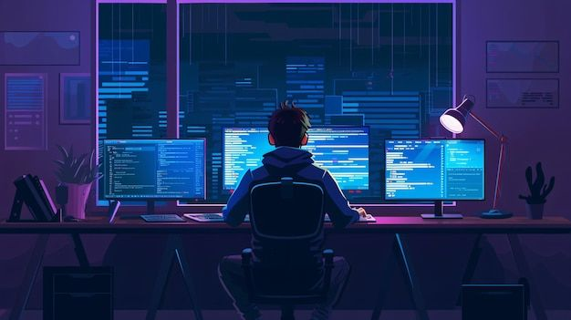

### Hi there! 👋 I'm Purnama Zohir

I'm an Information Systems student at **Universitas Bina Sarana Informatika (UBSI)**, passionate about building useful and impactful software.

🌱 Currently learning:

- **Laravel** for backend web development
- **Python** for data analysis and backend scripting

💻 Tech I'm familiar with:

- Pemrograman: Python, PHP, HTML, CSS, JavaScript
- Database: MySQL, Desain Database
- Framework: Laravel
- Analisis Sistem: ERD, UML, Use Case Diagram [analisis sistem](https://drive.google.com/drive/folders/1s0ik6gZNWavLnNoxVQ3INAXdSgYk4CB7?usp=sharing)
- Desain UI: [Design website 1](https://www.figma.com/design/acgrOIKB8u9usalzBqKA7P/MeowCare?node-id=1-2&t=1QhqXXMtZsqLHBig-1)

Software & Tools :
Git, GitHub
Microsoft Office (Word, Excel, PowerPoint)
Visual Studio Code, phpMyAdmin

🚧 Projects in progress:

- A postpaid electricity billing application using Laravel + Livewire
- Personal calculator app using vanilla JS

📚 I love learning by doing — always exploring new challenges in tech and development.

📫 Let's connect:

- [LinkedIn](https://www.linkedin.com/in/Zohir-zed)
- Email: zedzohir23@gmail.com

---

> "Code. Break. Fix. Learn. Repeat."
