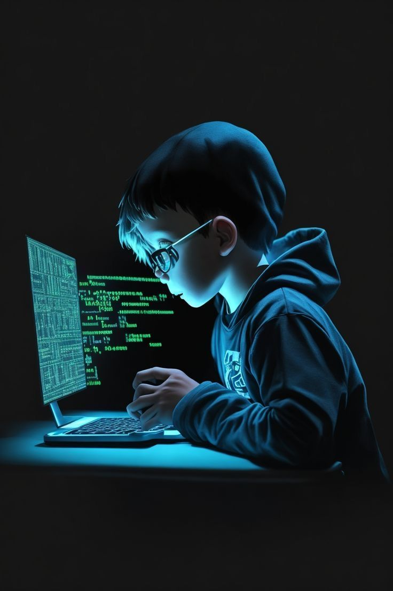

### Hi there! 👋 I'm Purnama Zohir

I'm an Information Systems student at **Universitas Bina Sarana Informatika (UBSI)**, passionate about building useful and impactful software.

🌱 Currently learning:

- **Laravel** for backend web development
- **Python** for data analysis and backend scripting

💻 Tech I'm familiar with:

- HTML, CSS, Js, Laravel, python
- MySQL, Git, GitHub

🚧 Projects in progress:

- A postpaid electricity billing application using Laravel + Livewire
- Personal calculator app using vanilla JS

📚 I love learning by doing — always exploring new challenges in tech and development.

📫 Let's connect:

- [LinkedIn](https://www.linkedin.com/in/Zohir-zed)
- Email: zedzohir23@gmail.com

---

> "Code. Break. Fix. Learn. Repeat."
